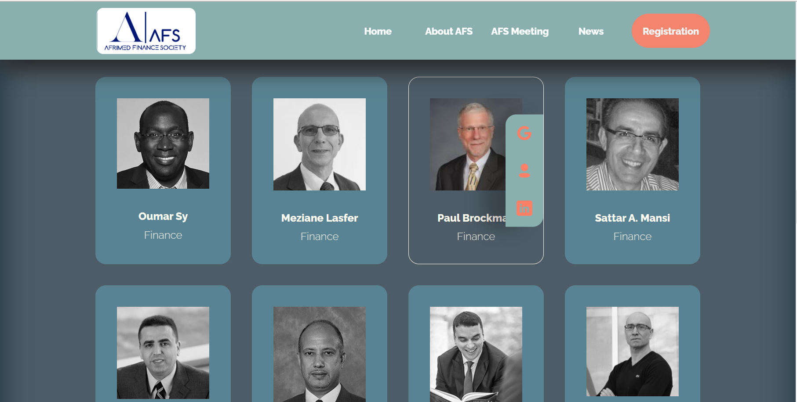
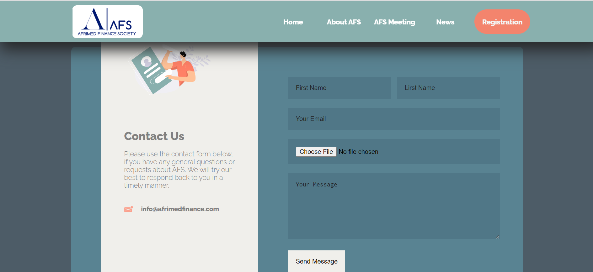
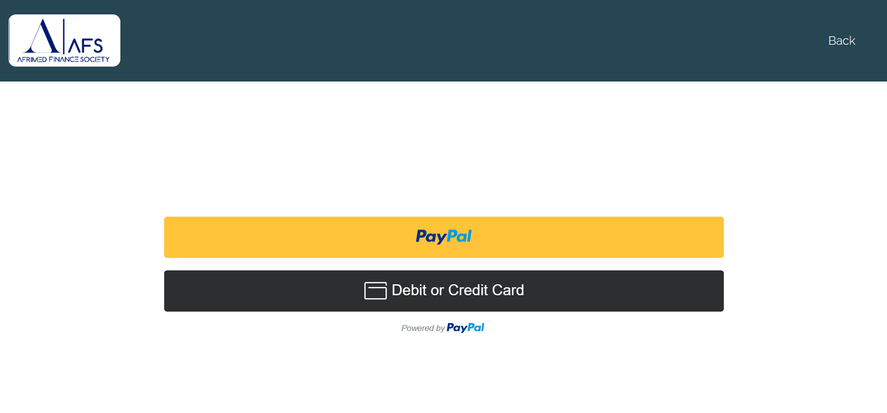

# Building-Website
## Building a Website for International Academic Conference:  
build a website for international academic conference. I used HTML, CSS, and JavaScript.
#### Home Page

### change status when the user hovers over it 

### Contact Page

 ### paypal payment
 
 ### and more...
 

## Pain Points:
I faced difficulties in linking to PayPal and linking the contact page, but with youtube videos, I have done it successfully.
## Outcomes Learned:
1. link PayPal
2. link the contact form to my client email
3. link youtube videos
4. automation within CSS and JavaScript.
5. learning more about html, CSS, JavaScript 
