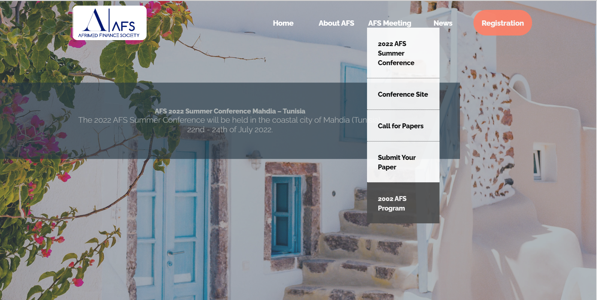

# Building-Website
## Building a Website for International Academic Conference:  
build a website for international academic conference. I used HTML, CSS, and JavaScript.
#### Home Page

### change status when the user hovers over it 

## Pain Points:
## Outcomes Learned:
